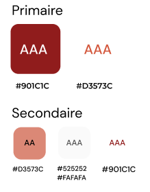

# 

## Objectif(s)
Créez un site accessible pour une plateforme de photographes nommé "FishEye" et versionnerez votre projet avec Git et GitHub.

## Résumé de la mission
Dans ce projet, vous travaillerez sur le développement d'un site web pour une plateforme d’artistes.

L'accent sera mis sur la création d'une application web accessible, modulaire et utilisant des design patterns en JavaScript.

Vous commencerez par créer un prototype fonctionnel du site web en utilisant HTML, CSS et JavaScript.

- Votre tâche consistera à intégrer diverses fonctionnalités telles que : 
  * La récupération et l'affichage des données 
  * La navigation entre les pages des photographes
  * Une modale de contact
  * Une LightBox pour les médias
  * La gestion des likes.

## Languages utilisés
- HTML
- CSS
- JavaScript
- Fetch Datas | Récupération de données (JSON)

## Compétences évaluées
- Assurer l'accessibilité d'un site web
- Développer une application web modulaire avec des design patterns
- Écrire du code JavaScript maintenable
- Gérer les évènements d'un site avec JavaScript

## Informations supplémentaires

### Éléments fournis par l'entreprise
- Des maquettes
- Des données JSON 
- Un code de base pour démarrer.

### Identité graphique
- Les couleurs sont : 
* 

### Cahier des charges
- L'accessibilité sera une priorité absolue dans ce projet. 
- Il vous faut développer une application web modulaire, en utilisant des design patterns en JavaScript.
- Cela implique l'écriture de code maintenable et la gestion des événements du site.
- Intégrer la récupération et l'affichage des données 
- Intégrer la navigation entre les pages des photographes
- Intégrer une modale de contact
- Intégrer une LightBox pour les médias
- Intégrer la gestion des likes.
- Les maquettes version Desktop uniquement sont fournies, proposer des versions du site pour tablette et mobile.
- Bien que le site web soit un prototype, il devrait correspondre aux maquettes et fonctionner correctement (pas d'erreur dans la console).